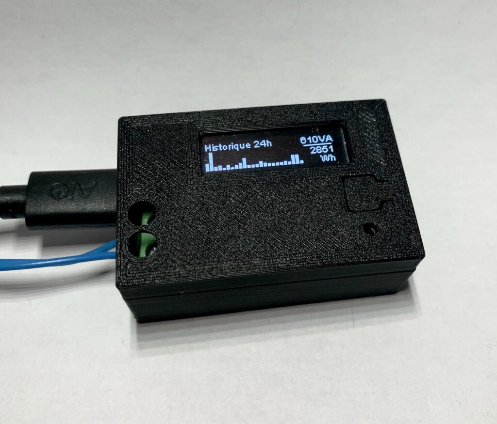
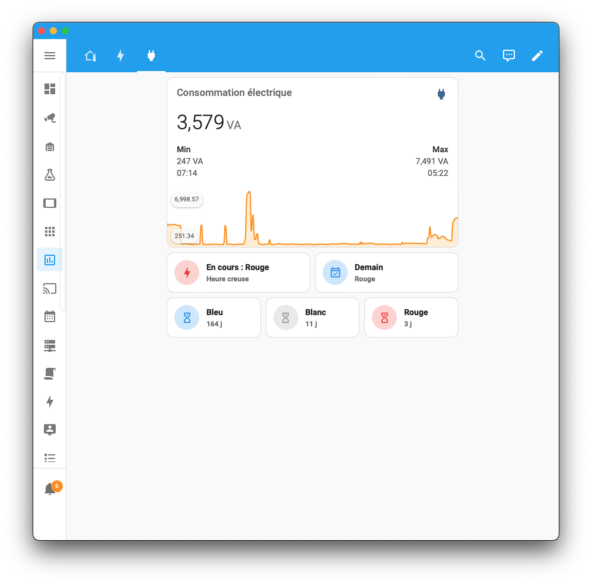
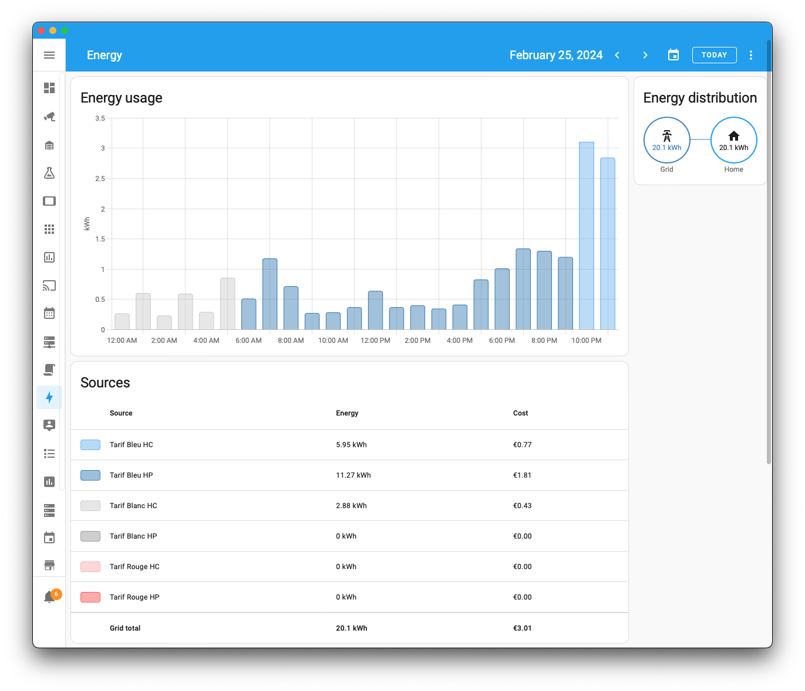

# Teleinfokit

An ESP01 based module that reads data from french energy meters and send them to a MQTT server. 

As this is mainly intended for french people, the rest of this file will be in french, as well as all the documentation.

## Description

Le firmware proposé ici est prévu pour fonctionner sur le [module TeleInfoKit](https://342apps.net) qui permet de collecter les données de télé-information émises par un compteur électrique de type Linky ou non-communicant (compteurs classiques blancs). Les données sont disponibles via l'écran du module.

Les données sont envoyées en temps réel sur un serveur MQTT pour être exploitées ensuite par un système domotique tel [Home Assistant](https://www.home-assistant.io/) ou un logiciel de monitoring comme [Grafana](https://www.home-assistant.io/).

Un [guide d'utilisation détaillé](./doc/user-guide.md) du module et son firmware sont disponible dans les sources du projet.

## Envoi des données en temps réel vers un serveur MQTT

Les données collectées depuis le bus de téléinformation du compteur (Linky ou anciens modèles) sont envoyées en temps réel sur un serveur MQTT (si configuré). La structure des messages et les topics utilisés sont décrits dans la [documentation mqtt](./doc/mqtt.md).

## Visualisation dans Home Assistant

Les données de consommation et les index peuvent être exploitées dans Home Assistant pour un affichage personnalisé. [L'intégration dans Home Assistant](./doc/configuration-ha.md) est automatisée.

Les données remontées sont compatibles avec un usage dans le [Dashboard Energie](./doc/dashboard-energy.md).

## Affichage intégré au module TeleInfoKit

Un afficheur intégré au module TeleInfoKit restitue un historique de consommation sur 24h, la consommation instantanée et d'autre informations décrites dans la documentation.

## Mises à jour OTA

Le firmware peut être mis à jour en mode OTA (Over The Air). Cela passe par la connexion wifi, sans besoin de matériel supplémentaire pour flasher le firmware.

## Hardware

Le module TeleInfoKit s'architecture autour du module ESP-01 basé sur le chip [ESP8266 d'Espressif](https://www.espressif.com/en/products/socs/esp8266). Le firmware disponible ici est prévu pour être compilé pour cette plateforme.

## Documentation des firmwares v2.x

Se référer au dossier [doc](/doc) pour les documents suivants:

* [Guide utilisateur](./doc/user-guide.md)
  * [Démarrage et configuration](./doc/user-guide.md#démarrage-et-configuration)
  * [Écrans](./doc/user-guide.md#écrans)
  * [Réinitialisation de la configuration](./doc/user-guide.md#réinitialisation-de-la-configuration-factory-reset)
* [Integration dans Home Assistant](./configuration-ha.md)
* [Dashboard Energie](./dashboard-energy.md)
* [Messages MQTT](./doc/mqtt.md)

## Ressources

La présentation du boitier TeleInfoKit est disponible sur [342apps.net](https://342apps.net) et les sources hardware sont disponibles sur le repo [teleinfokit-board](https://github.com/342apps/teleinfokit-board)

## Anciennes versions

Le firmware v2 a évolué par rapport à son prédécesseur. Pour retrouver la documentation de la version 1, voir les liens ci-dessous :

- [Guide d'utilisation v1](./user-guide_v1.x.md)
- [Messages MQTT v1](./mqtt_v1.md)