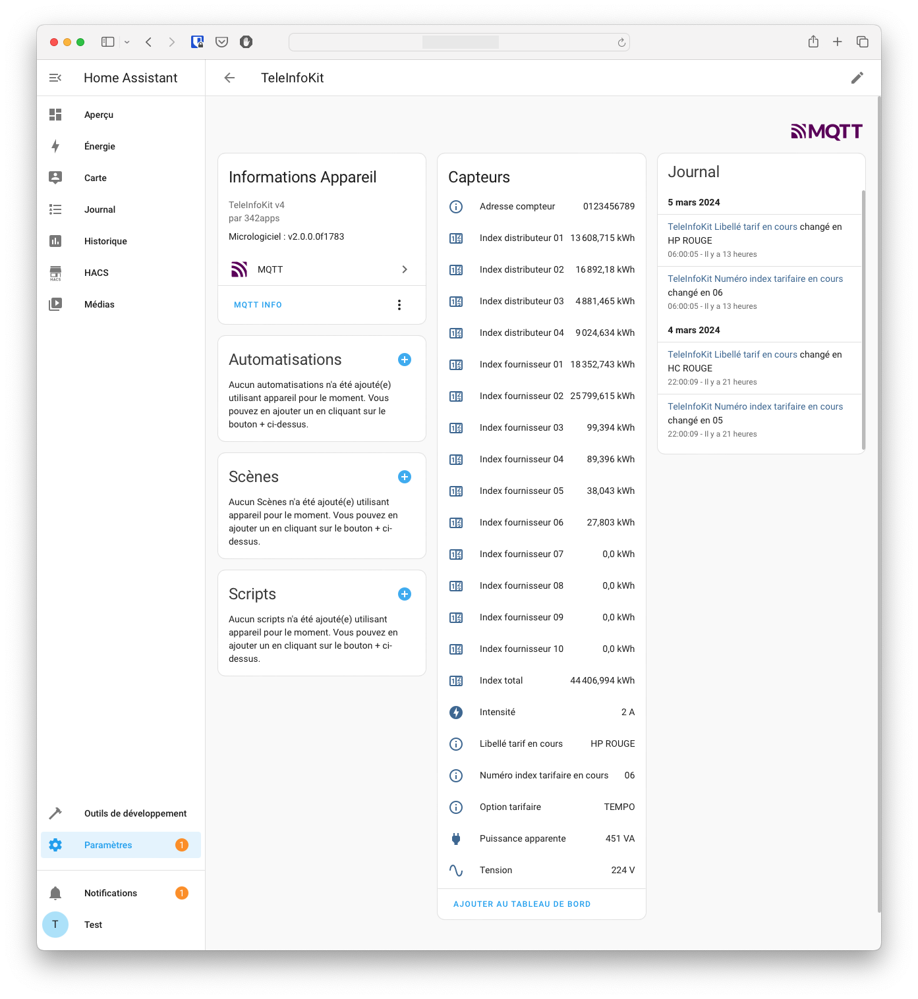
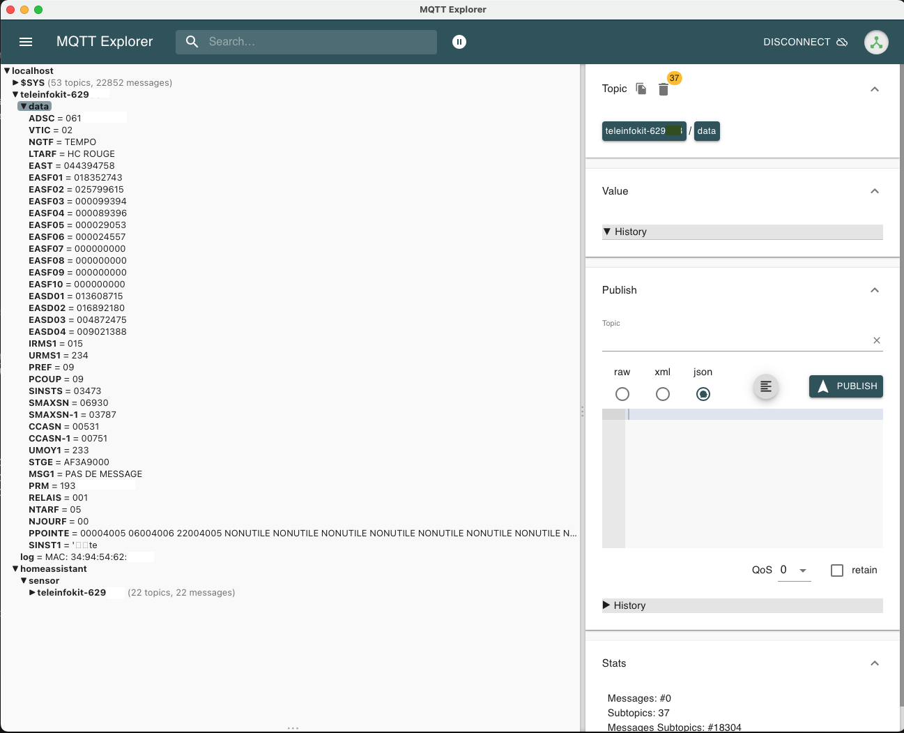

# Integration dans Home Assistant

## MQTT

L'intégration du module TeleInfoKit dans Home Assistant et l'envoi des données se fait à l'aide de messages MQTT il est donc nécessaire de configurer un *broker* MQTT sur votre serveur Home Assistant. 

Il suffit pour cela, si ce n'est pas déjà fait, d'ajouter l'intégration MQTT à votre instance de Home Assistant à l'aide de la documentation officielle, ou en cliquant sur ce lien pour l'integration MQTT :

[]((https://my.home-assistant.io/redirect/config_flow_start?domain=mqtt))

## Déclaration automatique dans Home Assistant

Grâce au système de [Discovery MQTT](https://www.home-assistant.io/integrations/mqtt/#mqtt-discovery), le TeleInfoKit est automatiquement intégré à Home Assistant. Une fois sa configuration WiFi et MQTT correctement réalisée, il va apparaître dans les devices MQTT sous le nom `TeleInfoKit`.

### Device

Dans la page du device en lui même vont se retrouver toutes les informations du device, et les sensors qui y sont rattachés.

L'exemple ci-dessous montre un boîtier TeleInfoKit relié à un compteur en mode TIC standard.



### Entités

Par défaut, les informations principales des données TIC sont automatiquement rattachées au device, qui apparaissent sous la forme de capteurs (ou sensors).

La liste des capteurs déclarés de manière automatique est la suivante pour un mode **TIC standard** :

| Etiquette | Définition                                     |
| --------- | ---------------------------------------------- |
| SINSTS    | Puissance apparente                            |
| IRMS1     | Intensité                                      |
| URMS1     | Tension                                        |
| EAST      | Index total                                    |
| EASF01    | Index fournisseur 01                           |
| EASF02    | Index fournisseur 02                           |
| EASF03    | Index fournisseur 03                           |
| EASF04    | Index fournisseur 04                           |
| EASF05    | Index fournisseur 05                           |
| EASF06    | Index fournisseur 06                           |
| EASF07    | Index fournisseur 07                           |
| EASF08    | Index fournisseur 08                           |
| EASF09    | Index fournisseur 09                           |
| EASF10    | Index fournisseur 10                           |
| EASD01    | Index distributeur 01                          |
| EASD02    | Index distributeur 02                          |
| EASD03    | Index distributeur 03                          |
| EASD04    | Index distributeur 04                          |
| ADSC      | Adresse compteur                               |
| NGTF      | Option tarifaire                               |
| LTARF     | Libellé tarif en cours                         |
| NTARF     | Numéro index tarifaire en cours                |
| NJOURF+1  | Numéro du prochain jour calendrier fournisseur |
| MSG1      | Message                                        |
| RELAIS    | Etat relais                                    |


Pour le mode **TIC historique** :

| Etiquette | Définition                              |
| --------- | --------------------------------------- |
| BASE      | Index BASE                              |
| HCHC      | Index heure cruse                       |
| HCHP      | Index heure pleine                      |
| PAPP      | Puissance apparente                     |
| IINST     | Intensité                               |
| ADCO      | Adresse compteur                        |
| OPTARIF   | Option tarifaire                        |
| PTEC      | Période tarifaire en cours              |
| EJPHN     | Index EJP heure normale                 |
| EJPHPM    | Index EJP heure de pointe mobile        |
| BBRHCJB   | Index Tempo heures creuses jours Bleus  |
| BBRHPJB   | Index Tempo heures pleines jours Bleus  |
| BBRHCJW   | Index Tempo heures creuses jours Blancs |
| BBRHPJW   | Index Tempo heures pleines jours Blancs |
| BBRHCJR   | Index Tempo heures creuses jours Rouges |
| BBRHPJR   | Index Tempo heures pleines jours Rouges |
| DEMAIN    | Couleur du lendemain                    |

## Autres données

Les données autres que celles déclarées automatiquement peuvent exploitées dans Home Assistant en les ajoutant manuellement via le fichier de configuration. En effet, toutes les données émises par le compteur sont envoyées sous la forme d'un message MQTT par le boîtier TeleInfoKit, mais seules les données ci-dessus sont pré-déclarées dans Home Assistant.

Exemple pour un sensor qui va remonter la valeur du label IINST, dont le topic est `teleinfokit-123456/data/iinst`

```yml
mqtt:
  sensor:
    - state_topic: "teleinfokit-123456/data/iinst"
      unique_id: teleinfokit_iinst
      unit_of_measurement: "A"
      device_class: current
      name: Intensité rack
      icon: mdi:power-plug
```

Le sensor est à adapter selon son besoin à partir des données publiées par le module et de la [documentation sensor MQTT](https://www.home-assistant.io/integrations/sensor.mqtt/).

Il est possible d'utiliser une application comme [MQTT Explorer](http://mqtt-explorer.com) pour visualiser tous les messages transitant sur un broker et donc l'ensemble des données émises par le compteur.

