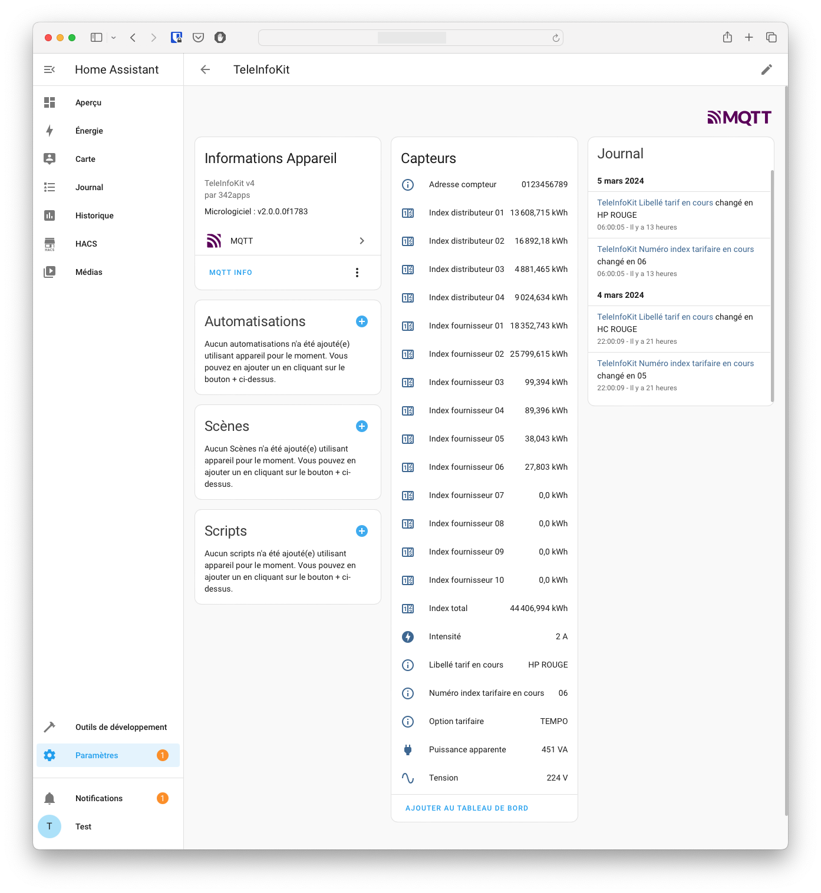

# Integration dans Home Assistant

## MQTT

L'intégration du module TeleInfoKit dans Home Assistant et l'envoi des données se fait à l'aide de messages MQTT il est donc nécessaire de configurer un *broker* MQTT sur votre serveur Home Assistant. 

Il suffit pour cela, si ce n'est pas déjà fait, d'ajouter l'intégration MQTT à votre instance de Home Assistant à l'aide de la documentation officielle, ou en cliquant sur ce lien pour l'integration MQTT :

[]((https://my.home-assistant.io/redirect/config_flow_start?domain=mqtt))

## Déclaration automatique dans Home Assistant

Grâce au système de [Discovery MQTT](https://www.home-assistant.io/integrations/mqtt/#mqtt-discovery), le TeleInfoKit est automatiquement intégré à Home Assistant. Une fois sa configuration WiFi et MQTT correctement réalisée, il va apparaître dans les devices MQTT sous le nom `TeleInfoKit`.

### Device

Dans la page du device en lui même vont se retrouver toutes les informations du device, et les sensors qui y sont rattachés.

L'exemple ci-dessous montre un boîtier TeleInfoKit relié à un compteur en mode TIC standard.



### Entités

Par défaut, les informations principales des données TIC sont automatiquement rattachées au device, qui apparaissent sous la forme de capteurs (ou sensors).

La liste des capteurs déclarés de manière automatique est la suivante pour un mode **TIC standard** :

| Etiquette | Définition                                     | Unité | Mode Triphase | Remarque                      |
| --------- | ---------------------------------------------- | ----- | ------------- | ----------------------------- |
| SINSTS    | Puissance apparente instantanée                | VA    |               |                               |
| SINSTI    | Puissance app. Instantanée injectée            | VA    |               | Autodéclaration depuis v2.1.0 |
| SMAXSN    | Puissance app. max. soutirée n                 | VA    |               | Autodéclaration depuis v2.1.0 |
| SMAXSN-1  | Puissance app. max. soutirée n-1               | VA    |               | Autodéclaration depuis v2.1.0 |
| IRMS1     | Intensité                                      | A     |               |                               |
| URMS1     | Tension                                        | V     |               |                               |
| UMOY1     | Tension moyenne                                | V     |               | Autodéclaration depuis v2.1.0 |
| EAST      | Index total                                    | Wh    |               |                               |
| EASF01    | Index fournisseur 01                           | Wh    |               |                               |
| EASF02    | Index fournisseur 02                           | Wh    |               |                               |
| EASF03    | Index fournisseur 03                           | Wh    |               |                               |
| EASF04    | Index fournisseur 04                           | Wh    |               |                               |
| EASF05    | Index fournisseur 05                           | Wh    |               |                               |
| EASF06    | Index fournisseur 06                           | Wh    |               |                               |
| EASF07    | Index fournisseur 07                           | Wh    |               |                               |
| EASF08    | Index fournisseur 08                           | Wh    |               |                               |
| EASF09    | Index fournisseur 09                           | Wh    |               |                               |
| EASF10    | Index fournisseur 10                           | Wh    |               |                               |
| EASD01    | Index distributeur 01                          | Wh    |               |                               |
| EASD02    | Index distributeur 02                          | Wh    |               |                               |
| EASD03    | Index distributeur 03                          | Wh    |               |                               |
| EASD04    | Index distributeur 04                          | Wh    |               |                               |
| EAIT      | Energie active injectée totale                 | Wh    |               | Autodéclaration depuis v2.1.0 |
| ADSC      | Adresse compteur                               |       |               |                               |
| NGTF      | Option tarifaire                               |       |               |                               |
| LTARF     | Libellé tarif en cours                         |       |               |                               |
| NTARF     | Numéro index tarifaire en cours                |       |               |                               |
| PREF      | Puissance app. de référence                    |       |               | Autodéclaration depuis v2.1.0 |
| NJOURF+1  | Numéro du prochain jour calendrier fournisseur |       |               |                               |
| MSG1      | Message                                        |       |               |                               |
| RELAIS    | Etat relais                                    |       |               |                               |
| IRMS2     | Intensité phase 2                              | A     | Oui           | Autodéclaration depuis v2.1.0 |
| IRMS3     | Intensité phase 3                              | A     | Oui           | Autodéclaration depuis v2.1.0 |
| URMS2     | Tension phase 2                                | V     | Oui           | Autodéclaration depuis v2.1.0 |
| URMS3     | Tension phase 3                                | V     | Oui           | Autodéclaration depuis v2.1.0 |
| UMOY2     | Tension moyenne Phase 2                        | V     | Oui           | Autodéclaration depuis v2.1.0 |
| UMOY3     | Tension moyenne Phase 3                        | V     | Oui           | Autodéclaration depuis v2.1.0 |
| SINSTS1   | Puissance apparente instantanée Phase 1        | VA    | Oui           | Autodéclaration depuis v2.1.0 |
| SINSTS2   | Puissance apparente instantanée Phase 2        | VA    | Oui           | Autodéclaration depuis v2.1.0 |
| SINSTS3   | Puissance apparente instantanée Phase 3        | VA    | Oui           | Autodéclaration depuis v2.1.0 |
| SMAXSN1   | Puissance app. max. soutirée n Phase 1         | VA    | Oui           | Autodéclaration depuis v2.1.0 |
| SMAXSN1-1 | Puissance app. max. soutirée n-1 Phase 1       | VA    | Oui           | Autodéclaration depuis v2.1.0 |
| SMAXSN2   | Puissance app. max. soutirée n Phase 2         | VA    | Oui           | Autodéclaration depuis v2.1.0 |
| SMAXSN2-1 | Puissance app. max. soutirée n-1 Phase 2       | VA    | Oui           | Autodéclaration depuis v2.1.0 |
| SMAXSN3   | Puissance app. max. soutirée n Phase 3         | VA    | Oui           | Autodéclaration depuis v2.1.0 |
| SMAXSN3-1 | Puissance app. max. soutirée n-1 Phase 3       | VA    | Oui           | Autodéclaration depuis v2.1.0 |

Pour le mode **TIC historique** :

| Etiquette | Définition                              | Unité | Mode Triphase | Remarque                      |
| --------- | --------------------------------------- | ----- | ------------- | ----------------------------- |
| BASE      | Index BASE                              | Wh    |               |                               |
| HCHC      | Index heure creuse                      | Wh    |               |                               |
| HCHP      | Index heure pleine                      | Wh    |               |                               |
| PAPP      | Puissance apparente                     | VA    |               |                               |
| IINST     | Intensité                               | A     |               |                               |
| ISOUSC    | Intensité souscrite                     |       |               | Autodéclaration depuis v2.1.0 |
| ADCO      | Adresse compteur                        |       |               |                               |
| OPTARIF   | Option tarifaire                        |       |               |                               |
| PTEC      | Période tarifaire en cours              |       |               |                               |
| EJPHN     | Index EJP heure normale                 | Wh    |               |                               |
| EJPHPM    | Index EJP heure de pointe mobile        | Wh    |               |                               |
| BBRHCJB   | Index Tempo heures creuses jours Bleus  | Wh    |               |                               |
| BBRHPJB   | Index Tempo heures pleines jours Bleus  | Wh    |               |                               |
| BBRHCJW   | Index Tempo heures creuses jours Blancs | Wh    |               |                               |
| BBRHPJW   | Index Tempo heures pleines jours Blancs | Wh    |               |                               |
| BBRHCJR   | Index Tempo heures creuses jours Rouges | Wh    |               |                               |
| BBRHPJR   | Index Tempo heures pleines jours Rouges | Wh    |               |                               |
| DEMAIN    | Couleur du lendemain                    |       |               |                               |
| ADPS      | Avertissement Dépassement Puissance     | A     |               | Autodéclaration depuis v2.1.0 |
| IINST1    | Intensité phase 1                       | A     | Oui           | Autodéclaration depuis v2.1.0 |
| IINST2    | Intensité phase 2                       | A     | Oui           | Autodéclaration depuis v2.1.0 |
| IINST3    | Intensité phase 3                       | A     | Oui           | Autodéclaration depuis v2.1.0 |
| PMAX      | Puissance maximale triphasée atteinte   | W     | Oui           | Autodéclaration depuis v2.1.0 |
| PPOT      | Présence des potentiels                 |       | Oui           | Autodéclaration depuis v2.1.0 |

Ces données sont définies par ENEDIS, émises par le compteur et pré-déclarées par le firmware dans Home Assistant pour faciliter leur utilisation. Le firmware ne génère aucune donnée de lui même.

> Lors d'un changement de configuration du TeleInfoKit (passage de mode TIC historique / standard, activation/désactivation mode triphase), l'ensemble des sensors auto-déclarés se réinitialise pour s'adapter à la nouvelle configuration. La liste des entités disponiles dans Home Assistant reflête automatiquement le changement de configuration.

## Mode triphase

> Cette section ne concerne que les firmwares en version **>= 2.1.0**

Lors de l'activation du mode triphase sur la page de confguration, la seule chose qui va changer est l'auto-déclaration des sensors dans Home Assistant pour que seules les données pertinentes par rapport au mode TIC soient présentes. 

Il n'y a aucun filtrage ou création de données par rapport à ce qu'envoie le compteur.

## Autres données

Les données autres que celles déclarées automatiquement peuvent exploitées dans Home Assistant en les ajoutant manuellement via le fichier de configuration. En effet, toutes les données émises par le compteur sont envoyées sous la forme d'un message MQTT par le boîtier TeleInfoKit, mais seules les données ci-dessus sont pré-déclarées dans Home Assistant.

Exemple pour un sensor qui va remonter la valeur du label IINST, dont le topic est `teleinfokit-123456/data/iinst`

```yml
mqtt:
  sensor:
    - state_topic: "teleinfokit-123456/data/iinst"
      unique_id: teleinfokit_iinst
      unit_of_measurement: "A"
      device_class: current
      name: Intensité
      icon: mdi:power-plug
```

Le sensor est à adapter selon son besoin à partir des données publiées par le module et de la [documentation sensor MQTT](https://www.home-assistant.io/integrations/sensor.mqtt/).

Il est possible d'utiliser une application comme [MQTT Explorer](http://mqtt-explorer.com) pour visualiser tous les messages transitant sur un broker et donc l'ensemble des données émises par le compteur.


## Note importante sur les étiquettes TIC avec caractère spécial

Certaines étiquettes émises par le compteur contiennent des caractères spéciaux qui ne peuvent pas etre interprétées correctement en tant que topic MQTT. Par exemple il existe l'étiquette `NJOURF+1` (Numéro du prochain jour calendrier fournisseur) qui contient le caractère `+`. Or le plus est un caractère spécial en MQTT qui permet de désigner un ensemble de topics. 

Le firmware va remplacer les caractères spéciaux par `_` dans le topic qui décrit le nom de l'étiquette TIC.

Les symboles remplacés par `_` sont :

- `+`
- `/`
- `#` 

Par exemple l'étiquette `NJOURF+1` devient `NJOURF_1` pour être accepté en tant que topic MQTT.
