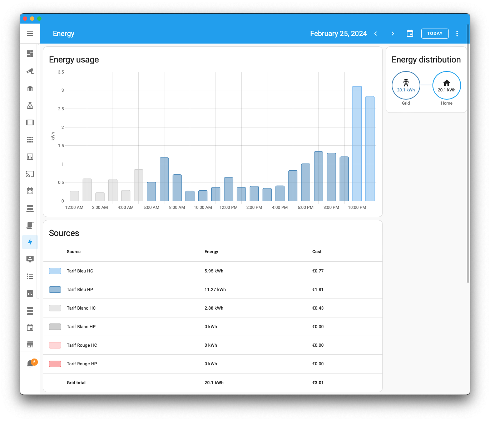

# Dashboard énergie

Une fois le TeleInfoKit [configuré et intégré à Home Assistant](./configuration-ha.md), il ne reste plus qu'a exploiter ces données, le plus simple et efficace étant avec le [dashboard Energie](https://www.home-assistant.io/dashboards/energy/) de Home Assistant.

Il est alors possible de visualiser ses données de consommation de manière détaillée, index par index et jour par jour, avec les coûts associés.



Ici on voit les index sur une journée, associés à un abonnement Tempo et ses différents tarifs.

Ceci est rendu possible par la configuration des sources de consommation avec les index 01 à 06 envoyés par le boîtier TeleInfoKit. Ils ont été renommés pour refléter leur signification dans le cas d'un abonnement tempo, puis leur tarif au Kwh assigné.


## Couleurs personnalisées pour les index

Par défaut les couleurs sont affectées selon un ordre arbitraire et défini par Home Assistant. Il est possible de les personnaliser via les thèmes. 

Pour cela, créer un thème ou modifier son thème en cours d'utilisation, recharger la configuration puis sélectionner ce thème pour que les modifications prennent effet.

L'exemple ci dessous crée un thème nommé `Energy Dashboard`, et est à créer dans votre dossier de thèmes. Il gère les modes clair et sombre en adaptant certaines couleurs.

```yaml
Energy dashboard:
  modes:
    dark:
      energy-grid-consumption-color-0: "#7dbff5"  # Bleu HC
      energy-grid-consumption-color-1: "#488fc2"  # Bleu HP
      energy-grid-consumption-color-2: "#f1f1f1"  # Blanc HC
      energy-grid-consumption-color-3: "#a8a8a8"  # Blanc HP
      energy-grid-consumption-color-4: "#ffb8b8"  # Rouge HC
      energy-grid-consumption-color-5: "#fc6a6a"  # Rouge HP
    light:
      energy-grid-consumption-color-0: "#7dbff5"  # Bleu HC
      energy-grid-consumption-color-1: "#488fc2"  # Bleu HP
      energy-grid-consumption-color-2: "#d4d4d4"  # Blanc HC
      energy-grid-consumption-color-3: "#a8a8a8"  # Blanc HP
      energy-grid-consumption-color-4: "#ffb8b8"  # Rouge HC
      energy-grid-consumption-color-5: "#fc6a6a"  # Rouge HP

```

Le rendu en thème sombre :

