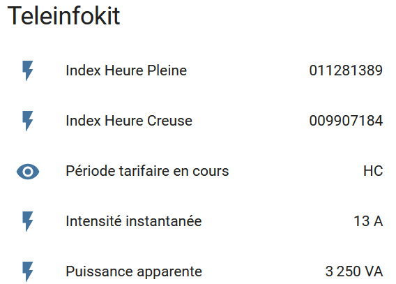

# Intégration dans Home Assistant

[Home assistant](home-assistant.io) est une solution domotique open source et gratuite.

Le broker MQTT doit être [configuré](https://www.home-assistant.io/docs/mqtt/broker/) dans home-assistant.

## Intégration via MQTT

Copiez la configuration suivante dans le fichier `configuration.yaml` (ou dans un [package](https://www.home-assistant.io/docs/configuration/packages/) dédié).

```yaml
sensor:
  - platform: mqtt
    state_topic: "teleinfokit/iinst"
    name: Intensité instantanée
    unit_of_measurement: A
    icon: 'mdi:flash'
    
  - platform: mqtt
    state_topic: "teleinfokit/papp"
    name: Puissance apparente
    unit_of_measurement: VA
    
  - platform: mqtt
    state_topic: "teleinfokit/imax"
    name: Intensité maximale appelée
    unit_of_measurement: VA
    
  - platform: mqtt
    state_topic: "teleinfokit/hp"
    name: Index Heure Pleine
    
  - platform: mqtt
    state_topic: "teleinfokit/hc"
    name: Index Heure Creuse
    
  - platform: mqtt
    state_topic: "teleinfokit/ptec"
    name: Période tarifaire en cours
    value_template: > 
       
        HP 
      
        HC
      
```

## Lovelace UI

Lovelace est l'interface de Home Assistant.

Créer une carte avec la configuration suivante:

``` yaml
type: entities
entities:
  - entity: sensor.index_heure_pleine
  - entity: sensor.index_heure_creuse
  - entity: sensor.periode_tarifaire_en_cours
  - entity: sensor.intensite_instantanee
  - entity: sensor.puissance_apparente
title: Teleinfokit
```

