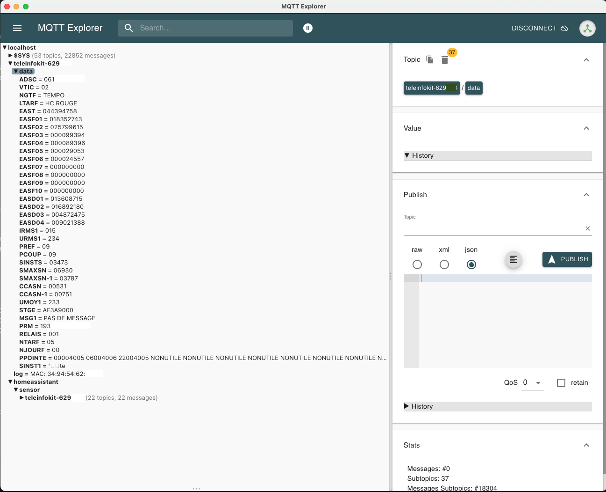

# Messages MQTT

Une fois les paramétrages correctement effectués, le module va envoyer régulièrement les données de consommation vers des topics MQTT.

Le topic de base pour tous les messages envoyés par le module est `teleinfokit-xxxxxx/`, ou `xxxxxx` correspond à l'ID unique de chaque module.

## Démarrage

Au démarrage du module, une fois la connexion wifi effectuée, des messages de log sont envoyés. Cela permet de s'assurer que le paramétrage est correct et que le module fonctionne.

Le topic et la payload sont les suivants :

|Topic|Payload|Description|
|--|--|--|
|`teleinfokit-xxxxxx/log`|`Startup teleinfokit-xxxxxx`||
|`teleinfokit-xxxxxx/log`|`Version: v2.x.xxxxx`|Version du firmware|
|`teleinfokit-xxxxxx/log`|`HW Version: x`|Révision matérielle de la board TeleInfoKit|
|`teleinfokit-xxxxxx/log`|`IP: xxx.xxx.xxx.xxx`|Adresse IP du module|
|`teleinfokit-xxxxxx/log`|`MAC: XX:XX:XX:XX:XX:XX`|Adresse MAC du module|

## Données de consommation temps réel

Une fois le module démarré, toutes les informations émises par le compteur sont envoyées en temps réel, tels que les informations de consommation et les index. Un message n'est envoyé que si la valeur a changé.

Le topic qui contient les données est `teleinfokit-xxxxxx/data`. Il y a ensuite un sous topic par information envoyée par le compteur. Par exemple, pour la puissance soutirée, avec une TIC au format historique, un message contenant la valeur sera envoyé dans le topic `teleinfokit-xxxxxx/data/papp`.

### Labels principaux

Le tableau ci-dessous donne les labels les plus classiques et utiles pour le mode historique :

| Label | Signification                          | Topic d'envoi                  |
| ----- | -------------------------------------- | ------------------------------ |
| PAPP  | Puissance apparente (ena VA)           | `teleinfokit-xxxxxx/data/PAPP` |
| BASE  | Index base (si simple tarif)           | `teleinfokit-xxxxxx/data/BASE` |
| HCHP  | Index heures pleines (si double tarif) | `teleinfokit-xxxxxx/data/HCHP` |
| HCHC  | Index heures creuses (si double tarif) | `teleinfokit-xxxxxx/data/HCHC` |

Pour les labels les plus utiles en mode standard : 

| Label  | Signification                | Topic d'envoi                    |
| ------ | ---------------------------- | -------------------------------- |
| SINSTS | Puissance apparente (ena VA) | `teleinfokit-xxxxxx/data/SINSTS` |
| EAST   | Index total                  | `teleinfokit-xxxxxx/data/EAST`   |
| EASF01 | Index fournisseur 1          | `teleinfokit-xxxxxx/data/EASF01` |
| EASF02 | Index fournisseur 2          | `teleinfokit-xxxxxx/data/EASF02` |
| EASF03 | Index fournisseur 3          | `teleinfokit-xxxxxx/data/EASF03` |
| ...    | ...                          | ...                              |
| EASF10 | Index fournisseur 10         | `teleinfokit-xxxxxx/data/EASF10` |
|        |                              |                                  |

Pour connaître tous les labels envoyés, se référer à la [documentation Enedis sur la téléinformation](https://www.enedis.fr/sites/default/files/Enedis-NOI-CPT_54E.pdf), dans la section *6.1 Trames de télé-information du mode historique* ou bien *6.2 Trames de télé-information du mode standard*.

Exemple de données reçues sur un compteur en mode historique :


Exemple de données reçues sur un compteur en mode standard :



> **Note:** les données ne sont envoyées que si la valeur a changé depuis la dernière trame TIC reçue.

> **Note:** toutes ces données du topic `teleinfokit/data/#` sont envoyées avec le flag "retained" à true pour que les clients récupèrent les dernières valeurs à leur connexion, même si elles ont été envoyées avant la connexion.

### Remarques sur les fréquences d'envoi

Les fréquences d'envoi sont paramétrables pour limiter la quantité de données envoyées au système qui les consomme. Il possible de configurer des fréquences différentes pour les données de puissance et les données d'index (voir [Démarrage et configuration](./user-guide.md#Demarrage-et-configuration) du guide d'utilisation).

Lorsque des valeurs différentes de 0 sont définies, les données ne seront envoyées que toutes les `x` secondes.

## Messages de discovery MQTT pour Home Assistant

Le module va se déclarer de lui même dans Home Assistant en envoyant des [messages de *discovery*](https://www.home-assistant.io/integrations/mqtt/#mqtt-discovery) pour les principales données.

Ces messages sont envoyés dans les topics `homeassistant/sensor/teleinfokit-xxxxxx/<LABEL>`.

Exemple d'un message de discovery pour l'index total d'un compteur mode standard (`EAST`) :

```json
{
    "name": "Index total",
    "dev_cla": "energy",
    "stat_cla": "total_increasing",
    "unit_of_meas": "kWh",
    "val_tpl": "{{float(value)/1000.0}}",
    "stat_t": "teleinfokit-xxxxxx/data/EAST",
    "uniq_id": "teleinfokit-xxxxxx-EAST",
    "obj_id": "teleinfokit-xxxxxx-EAST",
    "ic": "mdi:counter",
    "dev": {
        "ids": "teleinfokit-xxxxxx",
        "name": "TeleInfoKit",
        "sw": "v2.0.0.yyyyy",
        "mdl": "TeleInfoKit v4",
        "mf": "342apps"
    }
}
```

Il n'y a pas à se préoccuper de ces messages, ceux-ci sont à destination de Home Assistant et non utiles dans un autre contexte.

Se référer à la page [Configuration de Home Assistant](./configuration-ha.md) pour tous les détails.

## Identifiant client MQTT

L'identifiant de client MQTT utilisé par le module correspond à l'ID du chip ESP8266 du module TeleInfoKit.