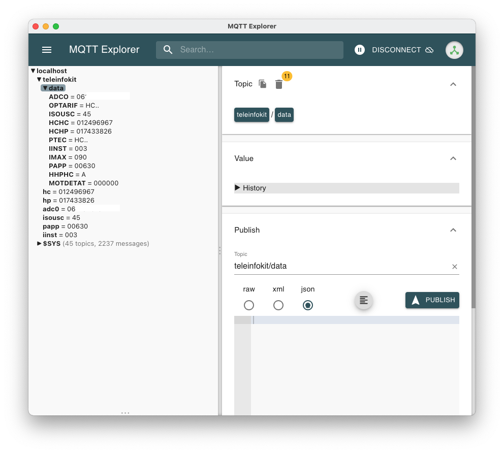

# Messages MQTT

Une fois les paramétrages correctement effectués, le module va envoyer régulièrement les données de consommation vers des topics MQTT.

Le topic de base pour tous les messages envoyés par le module est `teleinfokit/`.

## Démarrage

Au démarrage du module, une fois la connexion wifi effectuée, des messages de log sont envoyés. Cela permet de s'assurer que le paramétrage est correct et que le module fonctionne.

Le topic et la payload sont les suivants :

|Topic|Payload|Description|
|--|--|--|
|`teleinfokit/log`|`Startup`||
|`teleinfokit/log`|`Version: v0.x.xxxxx`|Version du firmware|
|`teleinfokit/log`|`HW Version: x`|Révision matérielle de la board TeleInfoKit|
|`teleinfokit/log`|`IP: xxx.xxx.xxx.xxx`|Adresse IP du module|
|`teleinfokit/log`|`MAC: XX:XX:XX:XX:XX:XX`|Adresse MAC du module|

## Informations statiques

Après le démarrage et avoir reçu les premières trames de téléinformation du compteur, 2 messages sont envoyés avec le flag **retain = true**.

|Topic|Payload|Exemple|Trame téléinformation|
|--|--|--|--|
|`teleinfokit/adc0`|Adresse du compteur|`062769678471`|ADC0|
|`teleinfokit/isousc`|Intensité souscrite (A)|`45`|ISOUSC|

## Données de consommation temps réel

Une fois le module démarré, les informations de consommation et les index sont envoyés en temps réel. Un message n'est envoyé que si la valeur a changé.

|Topic|Payload|Exemple|Trame téléinformation|Version mini firmware|Flag retained (v1+)|
|--|--|--|--|--|--|
|`teleinfokit/iinst`|Intensité instantanée : Courant efficace (en A)|`7`|IINST|||
|`teleinfokit/iinst1`|Intensité instantanée Phase 1 (si triphasé) : Courant efficace (en A)|`7`|IINST1|v1||
|`teleinfokit/iinst2`|Intensité instantanée Phase 2 (si triphasé) : Courant efficace (en A)|`6`|IINST2|v1||
|`teleinfokit/iinst3`|Intensité instantanée Phase 3 (si triphasé) : Courant efficace (en A)|`8`|IINST3|v1||
|`teleinfokit/papp`|Puissance apparente (en VA)|`1580`|PAPP|||
|`teleinfokit/imax`|Intensité maximale appelée *|`90`|IMAX|||
|`teleinfokit/hp`|Index heures pleines (si double tarif)|`24784235`|HCHP||oui|
|`teleinfokit/hc`|Index heures creuses (si double tarif)|`14582447`|HCHC||oui|
|`teleinfokit/base`|Index base (si simple tarif)|`46578`|BASE||oui|
|`teleinfokit/ptec`|Période tarifaire en cours|`HC..`|PTEC|||

*Note* L’intensité maximale «IMAX» est toujours égale à 90A dans le cas de ce compteur monophasé ([voir informations Enedis](https://www.enedis.fr/sites/default/files/Enedis-NOI-CPT_54E.pdf)).

## Données génériques (Firmware V1 et +)

A partir de la **version 1.0** du firmware TeleInfoKit, toute les données TIC sont envoyées par MQTT sans distinction. Cela permet d'être complètement générique sur tous les différents abonnements et étiquettes de données envoyées par la TIC.

Ces données génériques sont envoyées dans le topic `teleinfokit/data/`, puis chaque donnée dans un sous-topic dédié. Exemple pour la donnée de consommation instantanée PAPP, les données sont envoyées dans le topic `teleinfokit/data/PAPP`.

Exemple de données reçues avec un firmware v1 :

**Note:** les données ne sont envoyées que si la valeur a changé depuis la dernière trame TIC reçue.

**Note:** toutes ces données du topic `teleinfokit/data/#` sont envoyées avec le flag "retained" à true pour que les clients récupèrent les dernières valeurs à leur connexion, même si elles ont été envoyées avant la connexion.

### Remarques sur les fréquences d'envoi

Les fréquences d'envoi sont paramétrables pour limiter la quantité de données envoyées au système qui les consomme. Il possible de configurer des fréquences différentes pour les données de puissance et les données d'index (voir [Démarrage et configuration](./user-guide.md#Demarrage-et-configuration) du guide d'utilisation).

Lorsque des valeurs différentes de 0 sont définies, les données ne seront envoyées que toutes les `x` secondes.

Pour les données génériques envoyées depuis la v1 du firmware, la fréquence d'envoi est celle définie par le réglage du délai d'envoi de puissance.

## Identifiant client MQTT

L'identifiant de client MQTT utilisé par le module correspond à l'ID du chip ESP8266 du module TeleInfoKit.