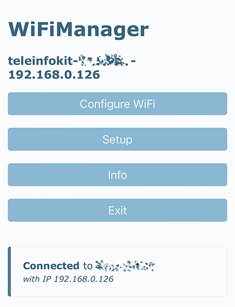
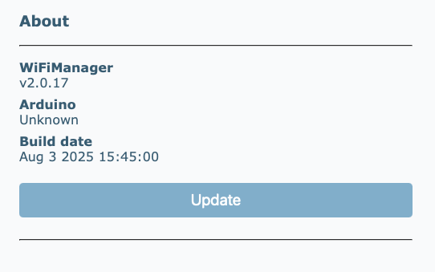
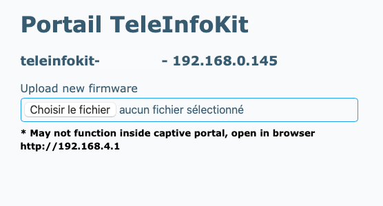
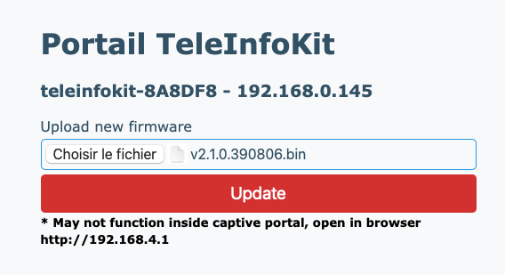

# Mise à jour du firmware

Le firmware peut être mis à jour via sa connexion WiFi de deux façons : soit via un navigateur avec un firmware précompilé, soit via un editeur de code en compilant soi même le firmware.

## Mise à jour via un navigateur

Cette procédure de mise à jour est très simple à appliquer et ne nécessite aucun outillage logiciel ni connaissance en développement, elle est donc largement conseillée.

Les étapes à suivre sont les suivantes :

### 1. Téléchargement du firmware

L'ensemble des firmwares TeleInfoKit se trouvent sur la [ page des release sur le repository Github](https://github.com/342apps/teleinfokit/releases). Télécharger le firmware correspondant à la version à installer. La version la plus récente dispose de l'indication `Latest`.

Le fichier de firmware à utiliser est le fichier `*.bin` uniquement.

### 2. Connexion à l'interface du TeleInfoKit

Se connecter à l'interface de configuration du TeleInfoKit à l'aide d'un navigateur, et taper son IP dans la barre d'adresse pour afficher sa page d'accueil. 

> L'adresse IP du teleinfokit peut etre affichée sur son écran en appuyant plusieurs fois sur son bouton.

### 3. Afficher la page `Infos` en cliquant sur le bouton correspondant.

En bas de la page `Infos`se trouve la section `About` avec un bouton `Update`. Cliquer sur ce bouton pour afficher la page de mise à jour.

### 4. Uploader le firmware

Sélectionner le fichier `.bin` de firmware téléchargé précedemment et cliquer sur `Update`.

La procédure de mise à jour commence. La page va rester inactive pendant quelques secondes et le teleinfokit sera figé le temps de la mise à jour (pas de remontée de donnée TIC, bouton sans effet). L'écran n'affichera **pas** de barre de progression de la mise à jour.

> **Ne pas débrancher le TeleInfoKit et ne faire aucune action sur celui-ci ou sur sa page web.**

La mise a jour devrait prendre moins d'une minute, le temps peut varier en fonction de la qualité du signal WiFi capté par le boitier.

Une fois la mise à jour effectuée, le boitier redémarrera sur la nouvelle version du firmware.

### Finalisation

La mise à jour est terminée. Bien que les paramètres devraient normalement être conservés, vérifier que ceux-ci sont toujours corrects dans la page de réglage.

## Mise à jour via la compilation du code source

Il est possible pour des besoins particuliers comme la personnalisation du firmware pour des besoins spécifiques de récupérer le code source, le modifier selon ses besoin, de le compiler et de l'envoyer sur le TeleInfoKit soi même via WiFi.

Cette procédure est à suivre pour les developpeurs qui souhaitent faire eux meme évoluer le firmware. C'est également cette procédure à suivre si la mise à jour du firmware se fait depuis un firmware **v1.x**.

La documentation se trouve actuellement sur la [page dédiée du site 342apps.net](https://342apps.net/flashage-du-teleinfokit/).