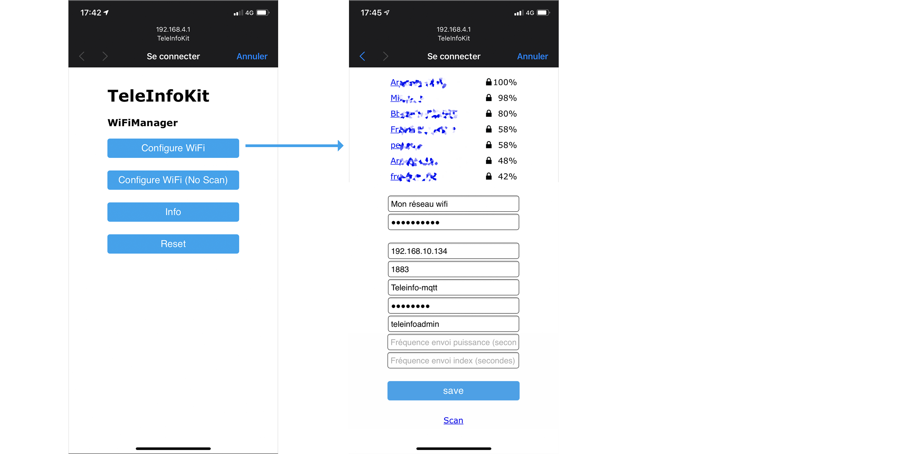

# Guide d'utilisation TeleInfoKit

## Démarrage et configuration

Lors du premier démarrage du module il est nécessaire de saisir les informations de connexion au réseau Wifi et au serveur MQTT.

Brancher le connecteur micro USB à une source d'alimentation 5V (chargeur USB classique), puis attendre jusqu'à l'affichage de l'écran suivant :

```
Hotspot Wifi: TeleInfoKit
192.168.4.1
```

Un réseau Wifi portant le SSID `TeleInfoKit` a été créé. A l'aide d'un smartphone ou d'un ordinateur, se connecter à ce réseau Wifi. Le mot de passe du hotspot wifi est `givememydata`. Une fois connecté au réseau wifi avec un smartphone, le captive portail s'affiche.



* Cliquer sur le bouton "Configure Wifi" pour faire apparaître la liste des réseaux wifi à portée (l'ESP-01 est compatible wifi 2.4GHz seulement).
* Taper le nom du réseau dans le champ SSID ou le sélectionner dans la liste.
* Saisir le mot de passe du réseau wifi
* Saisir l'adresse du serveur mqtt (ip ou alias dns)
* Saisir le login et le mot de passe du serveur MQTT (Si pas de login/mot de passe, laisser à vide)

Cliquer sur `Save`. Le module va afficher un message de confirmation puis continuer le démarrage avec un message `Configuration reseau ok`.

Le point d'accès wifi se désactive.

**TODO** procédure depuis un PC

### En cas de mauvais paramétrage MQTT

Si le serveur MQTT n'est pas accessible ou en cas d'erreur dans l'ip, login ou mot de passe MQTT, un message d'erreur s'affichera. Le démarrage se poursuit dans tous les cas, et le module reste accessible via ses APIs et le dashboard.

Pour corriger la configuration MQTT, [réinitialiser le module](#Réinitialisation-de-la-configuration).

### En cas d'erreur de paramétrage wifi

Si le paramétrage wifi est incorrect, le module ne poursuit pas son démarrage. Le point d'accès reste actif et la procédure est à recommencer. Si le point d'accès wifi `TeleInfoKit` ne réapparaît pas, il peut être nécessaire de redémarrer le module.

## Messages MQTT

Se référer au document [Messages MQTT](./mqtt.md) pour toutes les informations sur la structure des topics et le contenu des messages.

## Écrans

L'écran affiche différentes informations à travers plusieurs "pages". Pour passer d'une page à la suivante, effectuer un appui court le bouton du module. Les écrans vont défiler en boucle.

L'écran s'éteindra de lui même au bout d'une minute afin de limiter l'usure des pixels et éviter les effets de marquage. Pour réactiver l'écran, appuyer sur le bouton.

### Navigation

### Écran #1 : Historique

Ce premier écran rassemble un grand nombre d'informations. La zone principale est occupée par un graphe de la consommation sur les dernières 24h. 

A chaque barre correspond 1 heure. Les barres à gauche sont les plus anciennes, la barre la plus à droite est l'heure courante. La hauteur de la barre indique le nombre de Wh consommés sur cette période d'une heure (HC + HP).

La barre horizontale à droite indique la hauteur maximale des barres du graphe. Le nombre indiqué sous cette barre (2453Wh sur l'exemple ci-dessous) indique la consommation max sur une période d'une heure au cours des dernières 24h. Cela sert donc d'échelle pour le graphe, cette valeur étant la consommation associée à la barre la plus haute du graphe.


Le graphe est optimisé pour occuper le maximum de hauteur possible à l'écran. L'échelle (la plus grande consommation par tranche d'une heure) s'adapte donc au fur et a mesure du temps.

Au fil des heures, le graphe se décale vers la gauche, les nouvelles valeurs de consommation poussant les anciennes.

Dans le coin supérieur droit, la puissance consommée à l'instant t est affichée (ici 2610VA). Sa valeur est mise à jour en continu, environ toutes les 2 secondes.

### Écran #2 : Puissance / Intensite

Cet écran affiche la puissance consommée actuelle, remontée par le compteur.

```text
Puissance/Intensite
1800VA
8A
```

Ces valeur sont mises à jour en continu, environ toutes les 2 secondes.

### Écran #3 : Index compteurs

Cet écran affiche les index courants des heure creuse et heure pleine, remontés par le compteur.

```text
Index compteurs
HC 211485
HP 415443
```

Ces valeur sont mises à jour en continu, environ toutes les 2 secondes.

### Écran #4 : Informations compteur

Cet écran affiche les l'identifiant compteur, la puissance souscrite sur l'abonnement et la période tarifaire en cours (`HP..` : heure pleine, `HC..` : heure creuse).

```text
Id cpt 064875214
Puiss. souscrite : 90A
Per. tarif : HP..
```

### Écran #5 : Réseau

Sur cet écran, le réseau wifi auquel le module est connecté s'affiche, avec l'IP obtenue sur ce réseau. En dernière ligne l'adresse MAC de l'ESP est affichée, pour lui affecter une IP statique par exemple.

```text
Wifi <nom du reseau>
192.168.1.24
DC:4F:22:E3:27:A3
```

Les valeurs sont données à titre d'exemple.

### Écran #6 : Réinitialisation + version

L'écran est le suivant :

```text
Reinitialisation ?
Appui long pour reset...
v0.1.xxxxxx
```

La version de firmware est affichée sur la dernière ligne.

Pour activer la réinitialisation, faire un appui long sur le bouton. La procédure est détaillée dans la section [réinitialisation de la configuration](#Réinitialisation-de-la-configuration).

Un appui court passe à l'écran suivant sans réinitialisation.

### Écran #7 : Éteint

```text
Ecran OFF dans 5s.
Appui court pour rallumer.
```

Sans appui supplémentaire sur le bouton, l'écran va s'éteindre au bout de 5s au lieu d'une minute pour les autres écrans. Un nouvel appui sur le bouton réactive l'écran et passe à la page suivante.

## Réinitialisation de la configuration

Pour modifier ou supprimer les paramètres de connexion (Wifi et serveur MQTT), les étapes sont les suivantes :

* Naviguer jusqu'à l'écran 6

```text
Reinitialisation ?
Appui long pour reset...
```

* Effectuer un appui long
* L'écran va afficher

```text
Appui long pour confirmer
Appui court pour annuler
```

* Pour revenir en arrière et annuler la procédure, effectuer un clic rapide ou attendre 10s.
* Pour confirmer la réinitialisation, effectuer un nouveau clic long.
* L'écran va afficher successivement

```text
Reinitialisation en cours
```

puis

```text
Redemarrage
```

Le module a supprimé ses informations de connexion et va démarrer avec sa configuration d'origine, c'est à dire sans identifiants Wifi ni configuration MQTT enregistrés.

Pour enregistrer de nouveaux paramètres de connexion, voir la section [Démarrage et Configuration](#démarrage-et-configuration).
