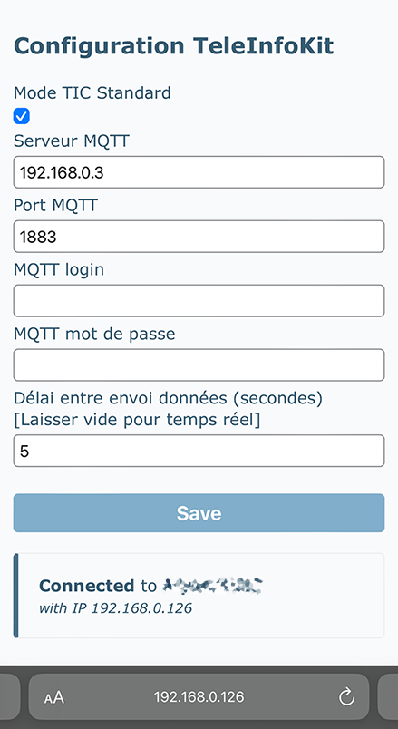

# Guide d'utilisation TeleInfoKit

## Démarrage et configuration

Lors du premier démarrage du module il est nécessaire de saisir les informations de connexion au réseau Wifi. Les informations concernant le serveur MQTT ou le mode TIC peuvent être également renseignées au démarrage, mais peuvent être saisies plus tard, une fois le module connecté au réseau WiFi.

Brancher le connecteur USB-C à une source d'alimentation 5V (chargeur USB classique), puis attendre jusqu'à l'affichage de l'écran suivant :

```text
Hotspot Wifi: TeleInfoKit
Clé: ABCD-1234-EF56 
```

Un réseau Wifi portant le SSID `TeleInfoKit` a été créé. A l'aide d'un smartphone ou d'un ordinateur, se connecter à ce réseau Wifi. Le mot de passe du hotspot wifi est affiché à l'écran. Il est unique à chaque boitier.

Une fois connecté au réseau wifi avec un smartphone, le captive portail s'affiche.


### Optionnel : configuration MQTT et TIC

Il est possible de configurer dès maintenant le serveur MQTT et les réglages pour les données TIC. Pour cela, se référer à la section [configuration MQTT et TIC](#configuration-mqtt-et-tic).

Ces réglages seront toujours accessibles une fois le module connecté au réseau WiFi.

### Configuration WiFi

Cliquer sur le bouton "Configure Wifi" pour faire apparaître la liste des réseaux wifi à portée (l'ESP-01 est compatible **WiFi 2.4GHz seulement**), puis :
* Taper le nom du réseau dans le champ SSID ou le sélectionner dans la liste.
* Saisir le mot de passe du réseau wifi

Cliquer sur `Save`. Le module va afficher un message de confirmation puis continuer le démarrage avec un message `Configuration reseau ok`.

Le point d'accès wifi se désactive.

**Note:** Le réseau wifi utilisé doit avoir accès à internet pour que l'heure puisse être obtenue depuis un serveur NTP.

## Configuration MQTT et TIC

La configuration est accessible via le bouton `Setup` la page principale 



### Mode TIC

Il existe deux mode TIC : Historique et Standard. Les anciens compteurs électroniques blanc génèrent seulement des informations TIC en mode Historique. Les compteurs linky peuvent être en mode Standard ou Historique. Le mode Standard envoie des informations plus nombreuses et plus précises que le mode Historique. Il est possible de demander à son fournisseur d'électricité de changer ce mode.

Sélectionner le mode TIC adapté au compteur en cochant la case `Mode TIC Standard` si le compteur est paramétré en mode Standard.

Le mode TIC courant sera affiché à gauche de l'écran du TeleInfoKit qui affiche le graphe (voir section [Ecran historique](#écran-1--historique)).

> Pour vérifier si votre compteur est en mode TIC Historique ou Standard, sur l'écran de celui-ci il sera affiché `Historique mode TIC` ou `Standard mode TIC` en appuyant quelques fois sur son bouton.

### Configuration MQTT

* Saisir l'adresse du serveur mqtt (ip ou alias dns)
* Saisir le login et le mot de passe du serveur MQTT (Si pas de login/mot de passe, laisser à vide)
* Pour limiter la fréquence d'envoi des données via MQTT, saisir un délai (en secondes). La valeur `0` ou un champ vide signifie un envoi en temps réel.

> **Note:** Quelques secondes après le démarrage, l'ensemble des données est envoyé afin de resynchroniser les éventuels systèmes à l'écoute sur toutes les valeurs.

> **Note:** Que ce soit en mode temps réel ou avec un délai défini, seules les données mises à jour sont envoyées.

> **Note:** En mode temps réel, les données sont transmises au rythme des trames envoyées par le compteur, soit environ **toutes les 1 à 2 secondes**.

### En cas de mauvais paramétrage MQTT

Si le serveur MQTT n'est pas accessible ou en cas d'erreur dans l'ip, login ou mot de passe MQTT, un message d'erreur s'affichera. Le démarrage se poursuit dans tous les cas, et le module reste accessible via son portail de configuration.

Pour corriger la configuration MQTT, suivre la procédure de [Configuration MQTT et TIC](#configuration-mqtt-et-tic) ou bien [réinitialiser le module](#réinitialisation-de-la-configuration-factory-reset).

### En cas d'erreur de paramétrage wifi

Si le paramétrage wifi est incorrect, le module ne poursuit pas son démarrage. Le point d'accès reste actif et la procédure est à recommencer. Si le point d'accès wifi `TeleInfoKit` ne réapparaît pas, il peut être nécessaire de redémarrer le module.

## Messages MQTT

Se référer au document [Messages MQTT](./mqtt.md) pour toutes les informations sur la structure des topics et le contenu des messages.

## Écrans

L'écran affiche différentes informations à travers plusieurs "pages". Pour passer d'une page à la suivante, effectuer un appui court le bouton du module. Les écrans vont défiler en boucle.

Un double clic permet de revenir au premier écran (Historique) depuis n'importe quel écran.

L'écran s'éteindra de lui même au bout d'une minute afin de limiter l'usure des pixels et éviter les effets de marquage. Pour réactiver l'écran, appuyer sur le bouton.

### Navigation

### Écran #1 : Historique

Ce premier écran rassemble un grand nombre d'informations. La zone principale est occupée par un graphe de la consommation sur les dernières 24h. 

A chaque barre correspond 1 heure. Les barres à gauche sont les plus anciennes, la barre la plus à droite est l'heure courante. La hauteur de la barre indique le nombre de Wh consommés sur cette période d'une heure (HC + HP).

La barre horizontale à droite indique la hauteur maximale des barres du graphe. Le nombre indiqué sous cette barre (2864Wh sur l'exemple ci-dessous) indique la consommation max sur une période d'une heure au cours des dernières 24h. Cela sert donc d'échelle pour le graphe, cette valeur étant la consommation associée à la barre la plus haute du graphe.


Le graphe est optimisé pour occuper le maximum de hauteur possible à l'écran. L'échelle (la plus grande consommation par tranche d'une heure) s'adapte donc au fur et a mesure du temps.

Au fil des heures, le graphe se décale vers la gauche, les nouvelles valeurs de consommation poussant les anciennes.

Dans le coin supérieur droit, la puissance consommée à l'instant t est affichée (ici 2985VA). Sa valeur est mise à jour en continu, environ toutes les 1 à 2 secondes.

Dans le coin haut gauche se trouve l'indication du mode TIC. Pour le mode Standard, un `S` apparait dans un carré, pour le mode Historique ce sera un `H`. 

### Écran #2 : Puissance / Intensité

Cet écran affiche la puissance consommée actuelle, remontée par le compteur.

```text
Puissance/Intensite
1800VA
8A
```

Ces valeur sont mises à jour en continu, environ toutes les 2 secondes.

### Écran #3 : Informations compteur

Cet écran affiche les l'identifiant compteur et l'index total en Wh (tag `EAST` pour le mode standard, et tag `BASE` + `HCHP` + `HPHP` pour le mode Historique).

```text
Compteur 123064875214
Index total 125456987

```

### Écran #4 : Réseau

Sur cet écran, le réseau wifi auquel le module est connecté s'affiche, avec l'IP obtenue sur ce réseau. En dernière ligne l'adresse MAC de l'ESP est affichée, pour lui affecter une IP statique par exemple.

```text
Wifi <nom du reseau>
192.168.1.24
DC:4F:22:E3:27:A3
```

Les valeurs sont données à titre d'exemple.

### Écran #5 : Date  /heure

Affiche la date et l'heure pour vérifier la bonne connexion réseau.

### Écran #6 : Réinitialisation + version + ID

L'écran est le suivant :

```text
Reinitialisation ?
Appui long pour reset...
v2.x.xxxxxx       ab12cd
```

La version de firmware est affichée sur la dernière ligne sur la gauche.

Sur la droite se trouve l'ID du chip ESP-01 (ici ab12cd) qui compose le nom du TeleInfoKit une fois qu'il est connecté au réseau.

Pour activer la réinitialisation, faire un appui long sur le bouton. La procédure est détaillée dans la section [réinitialisation de la configuration](#réinitialisation-de-la-configuration-factory-reset).

Un appui court passe à l'écran suivant sans réinitialisation.

### Écran #7 : Éteint

```text
Ecran OFF dans 5s.
Appui court pour rallumer.
```

Sans appui supplémentaire sur le bouton, l'écran va s'éteindre au bout de 5s au lieu d'une minute pour les autres écrans. Un nouvel appui sur le bouton réactive l'écran et passe à la page suivante.

## Réinitialisation de la configuration (Factory reset)

### Depuis les menus à l'écran

Pour modifier ou supprimer les paramètres (Réseau Wifi, serveur MQTT, authentification, fréquences d'envoi), les étapes sont les suivantes :

* Naviguer jusqu'à l'écran 6

```text
Reinitialisation ?
Appui long pour reset...
v0.x.xxxxx
```

* Effectuer un appui long
* L'écran va afficher

```text
Appui long pour confirmer
Appui court pour annuler
```

* Pour revenir en arrière et annuler la procédure, effectuer un clic rapide ou attendre 10s.
* Pour confirmer la réinitialisation, effectuer un nouveau clic long.
* L'écran va afficher successivement

```text
Reinitialisation en cours
```

puis

```text
Redemarrage
```

Le module a supprimé toutes ses informations de connexion et va démarrer avec sa configuration d'origine, c'est à dire sans identifiants Wifi ni configuration enregistrée.

Pour enregistrer de nouveaux paramètres de connexion, voir la section [Démarrage et Configuration](#démarrage-et-configuration).

### Au démarrage du module (Crash loop)

Si le module ne démarre plus du tout, il est également possible d'effectuer une remise à zéro complète, avant que celui-ci ne commence sa phase d'initialisation. Cela peut être utile en cas de crash en boucle si une mauvaise configuration a été effectuée, en cas de corruption du fichier de configuration interne, ou tout autre cas de figure non prévu.

Il suffit de presser le bouton frontal **une fois durant la première seconde du démarrage** du module. Le module peut être redémarré grâce à un appui sur le bouton reset, ou en débranchant et rebranchant sa prise usb.

**Attention à ne PAS appuyer sur le bouton AVANT le démarrage du module, celui-ci ne démarrera pas.**

Si la demande de réinitialisation est bien prise en compte, l'écran va afficher : 

```text
Reinitialisation ?
Appui long pour reset...
v0.x.xxxxx
```

* Effectuer un appui long
* L'écran va afficher

```text
Appui long pour confirmer
Appui court pour annuler
```
* Dans ce mode de réinitialisation, un appui court n'annulera pas, mais la procédure de reset sera abandonnée au bout de 10s et le module poursuivra son démarrage.
* Pour confirmer la réinitialisation, effectuer un nouveau clic long.
* L'écran va afficher successivement

```text
Reinitialisation en cours
```

puis

```text
Redemarrage
```

Comme lors de la réinitialisation classique, le module a supprimé toutes ses informations de connexion et va démarrer avec sa configuration d'origine, c'est à dire sans identifiants Wifi ni configuration enregistrée.

Pour enregistrer de nouveaux paramètres de connexion, voir la section [Démarrage et Configuration](#démarrage-et-configuration).

## API

Le firmware expose une API pour exploiter les données fournies par le module TeleInfoKit. Cette API est accessible par HTTP directement via l'adresse IP du module.

L'API est décrite entièrement au format OpenAPI V3 par le fichier [TeleInfoKit-openapi.v1.yaml](./TeleInfoKit-openapi.v1.yaml). Pour une lecture plus simple [l'éditeur de swagger.io](https://editor.swagger.io/) peut être utilisé.
